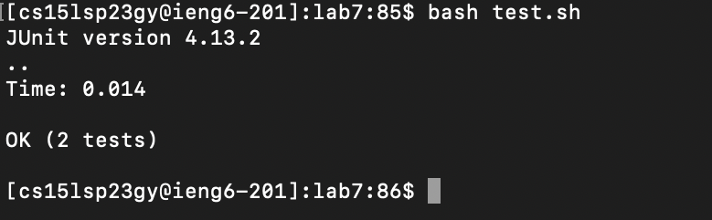

# Lab Report 4
## Doing it All from the Command Line

### 1. Log into ieng6
```<up> <enter>``` allowed me to access my ssh command as it was first in my local history,
booting me into my ieng6 account.


### 2. Clone your fork of the repository from your Github account
From the remote terminal, I once again used ```<up> <enter>```, as 
```git clone git@github.com:ryanvb17/lab7.git``` was my most recent remote command.


### 3. Run the tests, demonstrating that they fail
Next I typed ```cd lab7 <enter>``` to change the directory and used ```<up> <up> <up> <enter>``` to run ```bash test.sh```,
another command in my recent history that tested the file.


### 4. Edit the code file to fix the failing test
I then used ```<command-V>``` to paste ```vim ListExamples.java```, which I had pre-copied to my clipboard. 
After this I used ```i``` to enter insert mode and then held ```<down>``` followed by ```<right>```
which positioned my cursor in the perfect spot to use two keys, ```<delete> 2```, which fixed the code.


### 5. Run the tests, demonstrating that they now succeed
With my code fixed, I used ```<esc> :wq <enter>``` which saved my file and exited vim.
I could now use ```<up> <up> <enter>``` to once again run ```bash test.sh```, which returned the fixed results.


### 6. Commit and push the resulting change to your Github account
I then typed in ```git commit -a``` followed by the message, where I typed ```i``` to get into insert mode, 
then ```a``` which was my message of choice and finally the same ```<esc> :wq <enter>```, 
saving the file. Then I just typed the command ```git push origin main```, 
which ended my run after finishing updating the origin of these changes.


