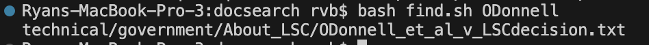

# Lab Report 5
---
## Debugging Scenario
Here is a question from a student:

After looking at the question, the TA response was as follows:

After looking through the correct formatting for the find command, the student 
altered their code, moving the path as such:

This change resulted in the following output

As you can see, this solution gave the student their intended output, fixing their issue.
This problem can be recreated using the docsearch repository at 
https://github.com/ucsd-cse15l-s23/docsearch.git
It only requires writing the new file of find.sh in the docsearch directory, 
which with the bug is written as:
```
: > find-results.txt
find -type f -name "*$1*" technical > find-results.txt
cat find-results.txt
```
The command that is being run is ```$ bash find.sh ODonnell```,
which must be run after the file is made.
As specified in the images above, to fix the bug you just move the path before the options:
```
: > find-results.txt
find technical -type f -name "*$1*" > find-results.txt
cat find-results.txt
```

## Reflection
Over the quarter I have enjoyed learning more about bash files. I had always seen them alongside code,
but was never sure of how to write one or even utilize it on the commandline.
I think these files are very useful for ease of access, and to be able to create and alter them will be very helpful for my future. 
